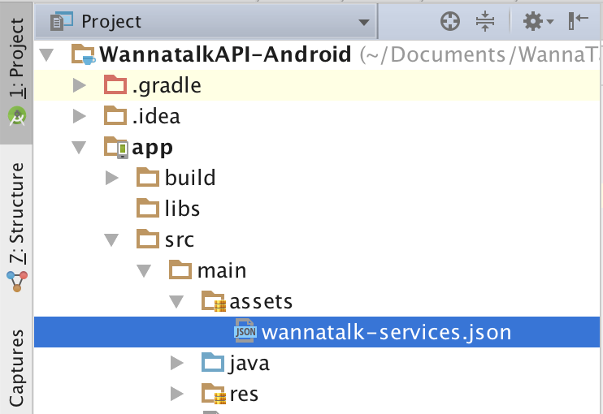

# WannatalkAPI-Android
The official Wannatalk Messenger Android API
## To run sample example
1. Request **wannatalk-services.json** from wannatalk.co

2. Copy **wannatalk-services.json** file to sample application `assets` directory


3. That's it! Run the app

## Steps to integrate wannatalk library into your project

1. Download [wannatalk.aar](wannatalksdk/wannatalksdk.aar) and import into your application
2. Enable `multiDexEnabled` and add below `dependencies` in your application **build.gradle**
```
android {
	defaultConfig {
	    // Enabling multidex support.
	    multiDexEnabled true
	}
	...
}

dependencies 
{
	implementation "com.android.support:design:28.0.0"
	implementation "com.android.support:recyclerview-v7:28.0.0"
	implementation "com.android.support:cardview-v7:28.0.0"
	implementation "com.android.support:palette-v7:28.0.0"
	implementation "com.android.support:support-core-utils:28.0.0"
	implementation "com.android.support:customtabs:28.0.0"

	implementation "com.arasthel:asyncjob-library:1.0.3"
	implementation "com.squareup:otto:1.3.8"

	implementation "com.squareup.retrofit2:retrofit:2.3.0"
	implementation "com.squareup.retrofit2:converter-gson:2.0.2"
	implementation "com.google.code.gson:gson:2.8.2"
	implementation "com.android.support:multidex:1.0.2"
	implementation "commons-io:commons-io:2.4"

	implementation "com.github.bumptech.glide:glide:3.7.0"
	implementation "jp.wasabeef:glide-transformations:2.0.1"
	implementation "com.facebook.fresco:fresco:1.5.0"
	implementation "com.facebook.fresco:animated-gif:1.5.0"


	implementation "com.amazonaws:aws-android-sdk-core:2.15.2"
	implementation "com.amazonaws:aws-android-sdk-s3:2.15.2"

	implementation "com.google.guava:guava:23.0-android"
	implementation "me.saket:better-link-movement-method:1.2"
}
```
3. Copy  **wannatalk-services.json** file to your application assets directory

## To link Wannatalk account
```java
WTLoginManager.StartLoginActivity(this);
```
## To link Wannatalk account with user credentials
```java
Bundle bundle = new Bundle();
bundle.putString("key1", "value1");
bundle.putString("key2", "value2");
WTLoginManager.SilentLoginActivity("<identifier>", bundle, this);
```    
## To unlink Wannatalk account
```java
WTLoginManager.Logout(this);
```    
## HelpDesk
### To load your organization profile
```java
// LoadOrganizationActivity(Activity activity, boolean autoOpenChat)
// Recent chat page will be opened when click on channel if autoOpenChat is true, otherwise chat list page will be opened.
WTSDKManager.LoadOrganizationActivity(this, true);
```    
## Collaboration
### To view all chats
```java
WTSDKManager.LoadChatListActivity(this);
```    
### To view all users
```java
WTSDKManager.LoadUsersActivity(this);
```
## Push notifications
1. Create android app in Firebase console
2. Download google-services.json configuration file and move it into the same directory as your root-level build.gradle file. 
3. Share us your Firebase project server key. You will find it in Cloud messaging tab of your Firebase project settings.(Open project in Firebase > Project Settings > Cloud Messaging)

## Other
### To show or hide guide button
```java
WTSDKManager.ShowGuideButton(false);               // default = YES
```

### To enable or disable sending audio message
```java
WTSDKManager.AllowSendAudioMessage(false);  // default = YES
```
### To show or hide add participants option in new ticket page and chat item profile page
```java
WTSDKManager.AllowAddParticipants(false);    // default = YES
```
### To show or hide remove participants option in chat item profile
```java
WTSDKManager.AllowRemoveParticipants(false); // default = NO
```
### To show or hide welcome message
```java
WTSDKManager.ShowWelcomeMessage(false);            // default = NO
```
### To show or hide Profile Info page
```java
WTSDKManager.ShowProfileInfoPage(false);           // default = YES
```
### To create auto tickets: 
Chat ticket will create automatically when auto tickets is enabled, otherwise default ticket creation page will popup
```java
WTSDKManager.EnableAutoTickets(true);           // default = NO
```
### To show or hide close chat button in chat page
```java
WTSDKManager.ShowExitButton(true);               // default = NO
```
### To show or hide participants in chat profile page
```java
WTSDKManager.ShowChatParticipants(false);          // default = YES
```
### To enable or disbale chat profile page
```java
WTSDKManager.EnableChatProfile(false);           // default = YES
```
### To allow modify in chat profile page
```java
WTSDKManager.AllowModifyChatProfile(false);       // default = YES
```
### To set Inactive chat timeout:  
Chat session will end if user is inactive for timeout interval duration. If timeout interval is 0, chat session will not end automatically. The default timout interval is 1800 seconds (30 minutes).
```java
long timeoutInterval = 1800; // Default Value: 1800 seconds ~ 30 minutes
WTSDKManager.SetInactiveChatTimeoutInterval(timeoutInterval);
```
